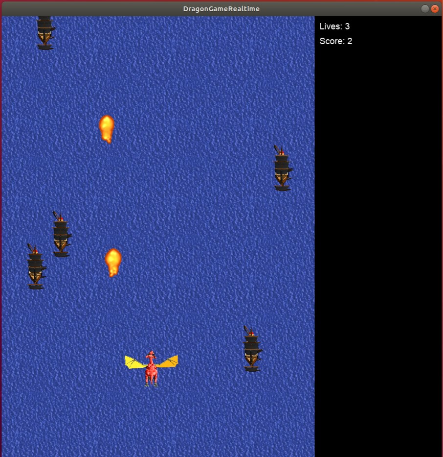

# DragonRT-Allegro
Simple retro game in C++, written using pthread and allegro library

## Requirements

* liballegro 5 https://github.com/liballeg/allegro5
* pthread library support
Game tested with Ubuntu 18.04.1 and Allegro 5

## How to install

Open the terminal and go to the folder DragonRT-Allegro, then type

	$ make
	
## How to use

Inside DragonRT-Allegro directory type
	
	$ ./DragonGameRealtime
